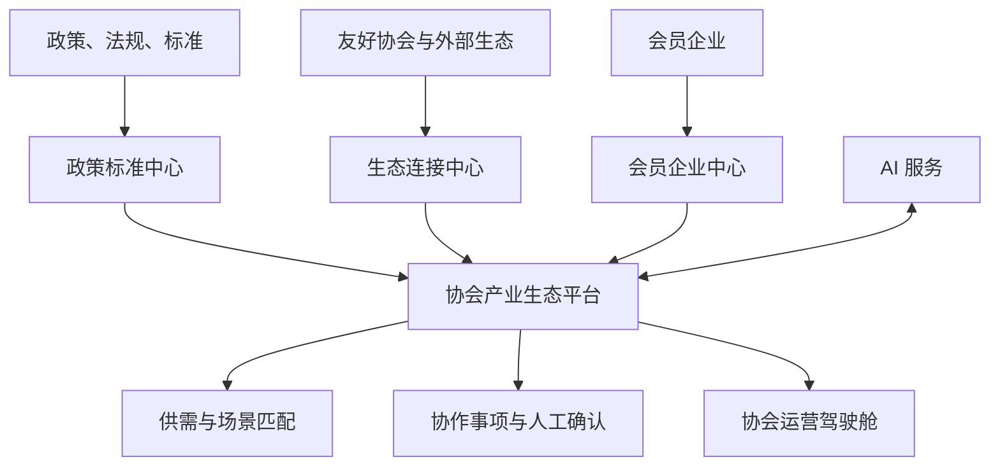

# 软件架构与模块边界

## 1. 总体设计

平台首期采用“模块化单体业务后端 + 独立智能能力服务”。业务事务、权限、知识库和审计集中在 Java 后端；确定性的结构化与匹配规则保留在 Python 服务，可选外部模型必须经 Java 适配层的费用、出境和审计门禁。等业务量和团队边界稳定后，再按模块拆分微服务。

## 2. 后端模块

| 模块 | 职责 | 不负责 |
|---|---|---|
| `iam` | 账号、身份、角色、数据范围、接口鉴权 | 企业业务分类 |
| `member` | 协会、会员企业、联系人、产品服务、资质案例 | AI 推断结果 |
| `policy` | 政策、法规、标准、影响对象和解读 | 外部协会关系 |
| `ecosystem` | 场景、供给、需求、企业关系、匹配记录 | 合同与交易担保 |
| `collaboration` | 定向邀请、协作事项、状态流转、人工反馈 | 自动替代商务谈判 |
| `ai-adapter` | 文档解析、分段、Embedding 适配、混合检索、带出处问答、模型降级与执行审计 | 核心业务事务 |
| `shared-kernel` | 统一响应、错误、ID、时间和通用安全约束 | 具体领域逻辑 |
| `bootstrap` | Spring Boot 启动、模块装配和运行配置 | 领域规则 |

模块之间优先通过应用服务接口和领域事件交互，禁止跨模块直接修改对方数据表。

## 3. 账号身份与企业业务角色

账号身份决定“能操作什么”，企业业务角色描述“企业在生态里做什么”，两者分开建模。一家企业可以同时是产品供应方、技术服务方和场景需求方。

首期账号身份：

- `SYSTEM_ADMIN`：平台配置、账号与安全审计。
- `ASSOCIATION_ADMIN`：协会全局业务管理和审核发布。
- `ASSOCIATION_OPERATOR`：资料采集、政策维护、匹配与协作运营；不能执行会员审核。
- `ENTERPRISE_ADMIN`：维护本企业账号、档案、产品和需求。
- `ENTERPRISE_MEMBER`：查看授权内容并参与协作反馈；企业档案写入由企业管理员负责。

所有核心数据还需叠加数据范围：`PRIVATE`（本企业与协会）、`ASSOCIATION`（本协会）、`PARTNERS`（本协会及已授权友好协会）、`MEMBERS`（平台会员）、`PUBLIC`（已登录用户公开可见）。写权限与读范围分开判定。

系统管理员通过 `X-Guanxian-Association-Id` 和可选的 `X-Guanxian-Enterprise-Id` 进入代管上下文。未选择协会时只允许全平台读取，禁止业务写入；选择协会后，读取和写入均收窄到该协会；继续选择企业后，企业级资源和匹配参与数据进一步收窄到该企业。路径、查询参数或请求体中的协会/企业只能与请求头上下文一致，不能临时扩大范围。账号停用、解绑或身份 tombstone 在每次请求解析数据范围时实时生效，旧 JWT 不能绕过。

## 4. AI 落地原则

首期匹配采用“硬条件过滤 + 规则评分 + 语义相似度预留”的混合方式。所有结果必须返回命中理由、缺失条件和置信度，协会运营人员确认后才能定向推送。

建议评分：应用场景 35%、供需能力 25%、技术资质 15%、案例 10%、地区与交付 10%、资料新鲜度和完整度 5%。真实上线前由协会通过样本回测调整权重。

AI 服务不得直接写业务库，不得直接发布政策解读，不得自动承诺成交。原始资料、AI 结果、人工修订和最终发布版本分别留痕。

## 5. 请求追踪与持久化演进

Web、业务后端和 AI 服务统一使用 `X-Request-Id` 关联一次调用。调用方可传入仅含字母、数字、点、下划线、冒号或连字符且不超过 128 字符的标识；缺失或非法值由服务重新生成。成功、校验失败、鉴权失败和内部异常均返回该响应头。后端日志上下文按请求建立并在结束时恢复或清理，避免线程与协程复用造成串号。

`member` 模块通过内部仓储端口访问会员快照，默认适配器为 PostgreSQL；进程内仓储只在显式测试配置下创建。信用代码唯一性由部分唯一索引兜底，更新与删除使用 `WHERE id = ? AND version = ?` 的数据库 CAS。Flyway 以版本 0 为既有非空数据库建立基线，当前迁移链为 V1–V23；已发布迁移不可重写，后续变更只能追加新版本。

V16 将 `policy_impact_analysis` 的协会归属固化为非空列，并通过政策、企业两侧复合外键及写入触发器保证三者协会一致；发现历史跨协会影响记录时先失败，不猜测归属。V17 将跨协会访问的关键不变量下沉到 PostgreSQL：企业同意必须绑定具体资源并具有一致状态，同一企业/目标协会/资源类型/资源在任一时刻最多一个 `ACTIVE` 授权；推荐必须跨两个不同协会、引用来源协会拥有或参与的需求/匹配，并保持审核状态与审核字段一致；关系的活动、暂停、撤销、到期状态只能携带各自合法的时间与操作者字段；共享策略必须具有合法时间区间、有限状态、非负版本、受支持的资源类型，并且 `visible_fields` 只能取对应资源的白名单字段。已到期但仍标记 `ACTIVE` 的旧同意不会在迁移中被静默改写，首次同键重授权才在事务内物化为 `EXPIRED`，并由部分唯一索引处理并发竞争。

V18 把匹配闭环的最终一致性下沉到 PostgreSQL。需求企业与候选企业必须不同；匹配只能依次经过协会推荐、单方确认、双方确认、邀请、洽谈、成果待归档和归档，关闭为带原因的终态。邀请、洽谈、反馈和成果的企业/协会必须来自父匹配；待处理/过期邀请不得携带应答文本，拒绝/取消必须有原因且与父匹配关闭原因一致，邀请解析后请求事实和终态均不可改写。普通洽谈从 `INITIAL_CONTACT` 开始、只追加且不能跳级，候选方接受邀请后也允许用首条 `TERMINATED` 直接结束，其摘要必须与父匹配关闭原因一致。`SUCCESS` 反馈不得携带关闭原因，`NO_DEAL`/`WITHDRAWN` 必须携带非空原因，成果必须建立在双方 `SUCCESS` 反馈上；推荐、确认和归档主体/时间等既成审计事实不可被后续版本覆盖。应用仍以 ETag/CAS 处理并发；数据库触发器要求版本严格递增，并用父行锁、部分唯一索引和延迟约束触发器在事务提交时检查跨表状态，因此兼容“先写子记录再转父状态”以及“先转 INVITED 再建邀请”的原子应用顺序。跨协会 `MATCH` 共享仍受显式字段白名单约束，V18 只追加授权字段 `outcomes`，不会开放内部审计字段。

V19 收口当前已实现的通知生命周期：未知历史状态先规范为 `FAILED`，再以检查约束限定 `PENDING`、`DELIVERED`、`READ`、`FAILED`、`ARCHIVED`；当前未实现的非政策、带筛选或非站内通知订阅在升级时停用，保留记录供审计，不将未支持的通道冒充为可用功能。

V20 收口附件内容校验状态：新上传只有在文件名、大小、媒体类型、扩展名、文件签名和 SHA-256 完整性校验通过后才记录为 `VALIDATED`；历史 `PENDING` 行无法仅凭元数据证明已校验，因此升级为 `REQUIRES_REUPLOAD` 并阻断内容下载和知识入库，待用户重新上传。开发环境可以使用同步内容验证器；生产 Profile 强制使用私网 ClamAV INSTREAM 扫描，连接失败、超时或恶意内容均失败关闭。

V21 冻结 `GX-MEMBER-SURVEY-2026-01` 采集契约：会员导入批次持久化原始文件 SHA-256、模板版本、提交单位、提交企业、主体和时间，导入行保留工作表行号；企业档案将产品、服务、需求和应用场景分开建模。知识文档新增生命周期版本、审核/删除主体、审核意见及不可变历史快照。文档必须在单一协会内依次经过草稿、送审和发布，停用、归档、软删除、恢复、重解析和重新 Embedding 都受 ETag/CAS 保护。

V22 为每个协会持久化 RAG 评测运行：数据集哈希、逐例结果、证据召回率、引用精确率、拒答正确率、估算费用和执行主体均可追溯。没有通过最新真实资料评测的协会，发布闸门只返回“管理协作平台”定位。

V23 把跨协会申请和企业逐资源同意纳入与关系、字段策略、推荐一致的强 ETag/CAS 合同。业务通知使用 shared-kernel 中的发布端口，由 notification 模块在业务事务内持久化 outbox 和站内消息；会员、生态和协作模块不直接依赖通知表结构。

知识资料支持 PDF、DOCX、XLSX、TXT、CSV，经 Apache Tika 解析、规范化分段和内容哈希后保存版本与来源附件。只有本协会已审核发布且来源附件扫描完成的内容可以召回；系统管理员也必须先选择协会，`PUBLIC` 不代表跨协会公开。Embedding 关闭时执行 PostgreSQL 关键词检索；开启并配置合规的 HTTPS 供应商后保存向量并执行词法/余弦混合召回。Embedding 与生成模型统一受数据出境开关、费用阈值和模型执行审计约束。每次回答保存检索追踪和片段引用，无证据时明确拒答。当前 JSONB 向量实现适合首期有界语料；大规模语料上线前应评估 pgvector/专用向量数据库及 ANN 索引。

只有在真实模型供应商、协会语料效果评测、费用阈值、数据出境审批和安全审查全部通过后，产品才可对外使用“AI 平台”名称；此前对外名称保持“管理协作平台”。

生产认证采用无状态 OIDC/JWT 资源服务器：后端校验 issuer、JWK 签名和白名单角色/权限，并禁止生产 Profile 启用 demo。令牌 `sub` 必须绑定 `user_account.external_subject`；协会身份绑定 `association_id`，企业身份同时绑定 `enterprise_id`。企业管理员只能维护绑定企业，协会管理员负责全协会审核；友好协会只读范围由 `association_relationship` 控制。会员写入、审核、删除、导入和账号绑定均写 `audit_log`。Web 使用 Authorization Code + PKCE 并从 `/users/me` 回读最终身份；页面角色只影响导航，接口授权始终由后端负责。会员编辑先读取强 ETag，再以 `If-Match` 更新；412 表示数据已被他人更新，客户端必须重新加载。

AI 请求边界使用纯 ASGI 中间件逐块统计正文大小，无 `Content-Length` 和分块传输同样受限，且不会预读或缓存完整正文。Web 页面通过统一异步资源状态消费同步/异步失败，只展示固定安全文案与校验后的请求编号；重试请求去重，组件卸载后不再接受晚到结果。

## 6. 首轮到可用版本

1. **工程骨架**：多模块、页面路由、OIDC/JWT、PostgreSQL/Flyway、基础 API、AI 确定性规则。
2. **数据冷启动**：调查表导入、字段校验、去重、资料完整度、协会审核。
3. **业务闭环**：企业产品/需求发布、候选匹配、人工确认、定向邀请、反馈归档。
4. **知识增强**：政策标准采集、RAG 问答、影响分析、消息订阅。
5. **横向生态**：友好协会接入、可见范围、跨协会协作和运营统计。
