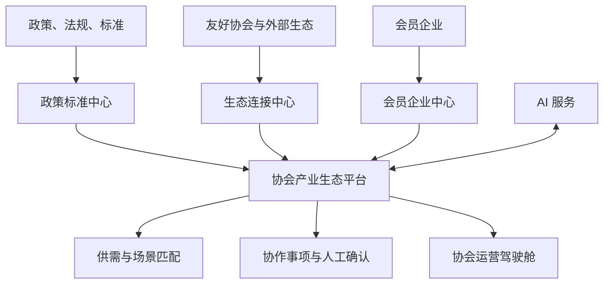

# 软件架构与模块边界

## 1. 总体设计

平台首期采用“模块化单体业务后端 + 独立智能能力服务”。业务事务、权限、知识库和审计集中在 Java 后端；确定性的结构化与匹配规则保留在 Python 服务，可选外部模型必须经 Java 适配层的费用、出境和审计门禁。等业务量和团队边界稳定后，再按模块拆分微服务。

## 2. 后端模块

| 模块 | 职责 | 不负责 |
|---|---|---|
| `iam` | 账号、身份、角色、数据范围、接口鉴权 | 企业业务分类 |
| `member` | 协会、会员企业、联系人、产品服务、资质案例 | AI 推断结果 |
| `policy` | 政策、法规、标准、影响对象和解读 | 外部协会关系 |
| `ecosystem` | 场景、供给、需求、企业关系、匹配记录 | 合同与交易担保 |
| `collaboration` | 定向邀请、协作事项、状态流转、人工反馈 | 自动替代商务谈判 |
| `ai-adapter` | 文档解析、分段、Embedding 适配、混合检索、带出处问答、模型降级与执行审计 | 核心业务事务 |
| `shared-kernel` | 统一响应、错误、ID、时间和通用安全约束 | 具体领域逻辑 |
| `bootstrap` | Spring Boot 启动、模块装配和运行配置 | 领域规则 |

模块之间优先通过应用服务接口和领域事件交互，禁止跨模块直接修改对方数据表。

## 3. 账号身份与企业业务角色

账号身份决定“能操作什么”，企业业务角色描述“企业在生态里做什么”，两者分开建模。一家企业可以同时是产品供应方、技术服务方和场景需求方。

首期账号身份：

- `SYSTEM_ADMIN`：平台配置、账号与安全审计。
- `ASSOCIATION_ADMIN`：协会全局业务管理和审核发布。
- `ASSOCIATION_OPERATOR`：资料采集、政策维护、匹配与协作运营；不能执行会员审核。
- `ENTERPRISE_ADMIN`：维护本企业账号、档案、产品和需求。
- `ENTERPRISE_MEMBER`：查看授权内容并参与协作反馈；企业档案写入由企业管理员负责。

所有核心数据还需叠加数据范围：`PRIVATE`（本企业与协会）、`ASSOCIATION`（本协会）、`PARTNERS`（本协会及已授权友好协会）、`MEMBERS`（平台会员）、`PUBLIC`（已登录用户公开可见）。写权限与读范围分开判定。

系统管理员通过 `X-Guanxian-Association-Id` 和可选的 `X-Guanxian-Enterprise-Id` 进入代管上下文。未选择协会时只允许全平台读取，禁止业务写入；选择协会后，读取和写入均收窄到该协会；继续选择企业后，企业级资源和匹配参与数据进一步收窄到该企业。路径、查询参数或请求体中的协会/企业只能与请求头上下文一致，不能临时扩大范围。账号停用、解绑或身份 tombstone 在每次请求解析数据范围时实时生效，旧 JWT 不能绕过。

## 4. AI 落地原则

首期匹配采用“硬条件过滤 + 规则评分 + 语义相似度预留”的混合方式。所有结果必须返回命中理由、缺失条件和置信度，协会运营人员确认后才能定向推送。

建议评分：应用场景 35%、供需能力 25%、技术资质 15%、案例 10%、地区与交付 10%、资料新鲜度和完整度 5%。真实上线前由协会通过样本回测调整权重。

AI 服务不得直接写业务库，不得直接发布政策解读，不得自动承诺成交。原始资料、AI 结果、人工修订和最终发布版本分别留痕。

## 5. 请求追踪与持久化演进

Web、业务后端和 AI 服务统一使用 `X-Request-Id` 关联一次调用。调用方可传入仅含字母、数字、点、下划线、冒号或连字符且不超过 128 字符的标识；缺失或非法值由服务重新生成。成功、校验失败、鉴权失败和内部异常均返回该响应头。后端日志上下文按请求建立并在结束时恢复或清理，避免线程与协程复用造成串号。

`member` 模块通过内部仓储端口访问会员快照，默认适配器为 PostgreSQL；进程内仓储只在显式测试配置下创建。信用代码唯一性由部分唯一索引兜底，更新与删除使用 `WHERE id = ? AND version = ?` 的数据库 CAS。Flyway 以版本 0 为既有非空数据库建立基线，当前迁移链为 V1–V17；已发布迁移不可重写，后续变更只能追加新版本。

V16 将 `policy_impact_analysis` 的协会归属固化为非空列，并通过政策、企业两侧复合外键及写入触发器保证三者协会一致；发现历史跨协会影响记录时先失败，不猜测归属。V17 将跨协会访问的关键不变量下沉到 PostgreSQL：企业同意必须绑定具体资源并具有一致状态，同一企业/目标协会/资源类型/资源在任一时刻最多一个 `ACTIVE` 授权；推荐必须跨两个不同协会、引用来源协会拥有或参与的需求/匹配，并保持审核状态与审核字段一致；关系的活动、暂停、撤销、到期状态只能携带各自合法的时间与操作者字段；共享策略必须具有合法时间区间、有限状态、非负版本、受支持的资源类型，并且 `visible_fields` 只能取对应资源的白名单字段。已到期但仍标记 `ACTIVE` 的旧同意不会在迁移中被静默改写，首次同键重授权才在事务内物化为 `EXPIRED`，并由部分唯一索引处理并发竞争。

知识资料支持 PDF、DOCX、XLSX、TXT、CSV，经 Apache Tika 解析、规范化分段和内容哈希后保存版本与来源附件。Embedding 关闭时执行 PostgreSQL 关键词检索；开启并配置合规的 HTTPS 供应商后保存向量并执行词法/余弦混合召回。每次回答保存检索追踪和片段引用，无证据时不生成答案。当前 JSONB 向量实现适合首期有界语料；大规模语料上线前应评估 pgvector/专用向量数据库及 ANN 索引。

只有在真实模型供应商、协会语料效果评测、费用阈值、数据出境审批和安全审查全部通过后，产品才可对外使用“AI 平台”名称；此前对外名称保持“管理协作平台”。

生产认证采用无状态 OIDC/JWT 资源服务器：后端校验 issuer、JWK 签名和白名单角色/权限，并禁止生产 Profile 启用 demo。令牌 `sub` 必须绑定 `user_account.external_subject`；协会身份绑定 `association_id`，企业身份同时绑定 `enterprise_id`。企业管理员只能维护绑定企业，协会管理员负责全协会审核；友好协会只读范围由 `association_relationship` 控制。会员写入、审核、删除、导入和账号绑定均写 `audit_log`。Web 使用 Authorization Code + PKCE 并从 `/users/me` 回读最终身份；页面角色只影响导航，接口授权始终由后端负责。会员编辑先读取强 ETag，再以 `If-Match` 更新；412 表示数据已被他人更新，客户端必须重新加载。

AI 请求边界使用纯 ASGI 中间件逐块统计正文大小，无 `Content-Length` 和分块传输同样受限，且不会预读或缓存完整正文。Web 页面通过统一异步资源状态消费同步/异步失败，只展示固定安全文案与校验后的请求编号；重试请求去重，组件卸载后不再接受晚到结果。

## 6. 首轮到可用版本

1. **工程骨架**：多模块、页面路由、OIDC/JWT、PostgreSQL/Flyway、基础 API、AI 确定性规则。
2. **数据冷启动**：调查表导入、字段校验、去重、资料完整度、协会审核。
3. **业务闭环**：企业产品/需求发布、候选匹配、人工确认、定向邀请、反馈归档。
4. **知识增强**：政策标准采集、RAG 问答、影响分析、消息订阅。
5. **横向生态**：友好协会接入、可见范围、跨协会协作和运营统计。
